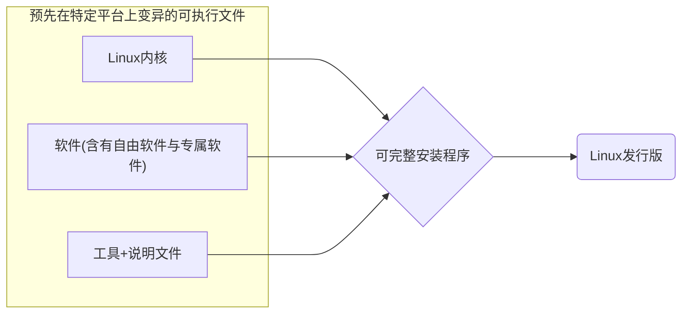

# [目录](../Linux.md)

- 是一个`操作系统内核`
- `核心概念`：所有的程序和系统设备都是`文件`
- 前身是[`Unix`](https://baike.baidu.com/item/unix/219943)，发展成为[`BSD`](https://baike.baidu.com/item/BSD?fromModule=lemma_search-box)
- [`GUN`](https://baike.baidu.com/item/GNU%E8%AE%A1%E5%88%92/981157)（建立一个自由、开放的UNIX操作系统）
- `Linux`使用的是[`GUN GPL`](https://baike.baidu.com/item/GNU%E9%80%9A%E7%94%A8%E5%85%AC%E5%85%B1%E8%AE%B8%E5%8F%AF%E8%AF%81/393832) 开源协议，使Linux可以自由复制、修改、再发行、反馈社区、取消GPL授权、单纯销售。
	- 开源的优点：软件安全性好、运行性能号、除错时间短、源代码永远都在

## `Linux`的内核版本
- 样子类似于`3.10.0-123.e17.x86-64"
- 现在分为`主线版本(MinLine)`与`长期维护版本(Longterm version)`
- 可以通过命令`uname -r`查询内核版本

## `Linux发行版`
- 因为`Linux`是一个`内核`而不是完整的操作系统。并且完全开源免费，所有有了很多不同的`Linux`发行版，也就是完整的操作系统。

- 主流发行版
	- [Debian](https://www.debian.org/) --- 追求稳定，不最求最新 用`apt`
	- [Ubuntu](https://cn.ubuntu.com/) --- 基于Debian，平衡新旧版本
	- [Kali](https://www.kali.org/) --- 基于Debian，集成开源计算机安全软件
	- [Mint](https://linuxmint.com/) --- 基于Debian，继承了Ubuntu的优点并且有良好的人机交互体验
	- [CentOS](https://www.centos.org/) --- 红帽公司出品的免费发行版，但是最近开始收费 用`yum`
	- [Fedora](https://getfedora.org/) --- 由红帽公司赞助，通常会用最新的桌面环境
	- [Arch](https://archlinux.org/) --- 非常激进并且追求客制化系统的发行版 用`pacman`
	- [Manjaro](https://manjaro.org/) --- 基于Arch 比Arch友好很多
	- [Gentoo](https://www.gentoo.org/) --- 完全由自己编译，可以胜任任何工作 用`emerge`
	- [OpenSUSE](https://www.opensuse.org/) --- 非常华丽的界面 用`zypper`
- 国内发行版
	- [Deepin深度](https://www.deepin.org/index/zh) --- 对国内用户习惯友好
	- [UOS统信](https://home.uniontech.com/) --- 基本是深度的可商用版本
- 邪道说法：安卓也是linux
- 国内一般都可以通过各大**大学**和**企业**的镜像下载，比如清华、阿里
	- [清华](https://mirrors.tuna.tsinghua.edu.cn/)
	- [浙大](http://mirrors.zju.edu.cn/)
	- [中科大](http://mirrors.ustc.edu.cn/)
	- [兰大](http://mirror.lzu.edu.cn/)
	- [上交大](https://mirrors.sjtug.sjtu.edu.cn/)
	- [电子科大](https://mirrors.ustc.edu.cn/help/)
	- [阿里](https://developer.aliyun.com/mirror/)
	- [腾讯](https://mirrors.tencent.com/)
	- [网易](http://mirrors.163.com/)

# [目录](../Linux.md)